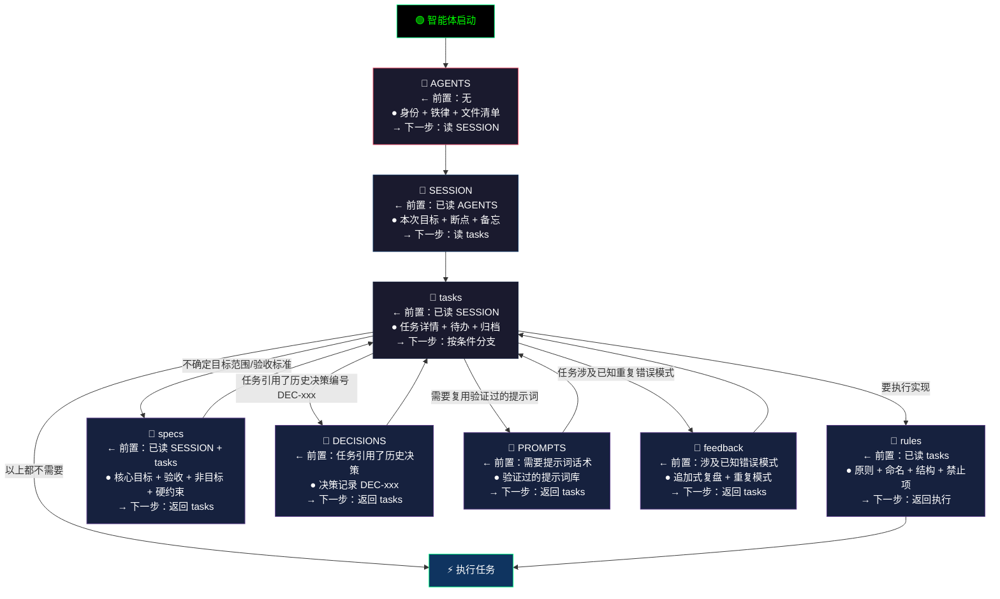
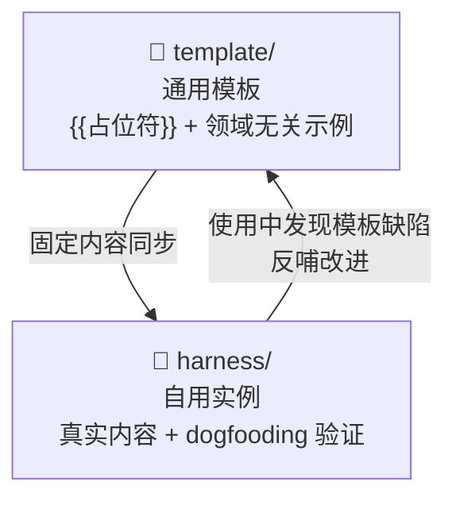

# Harness-Engineering

> AI 编程助手的"自动驾驶系统" — 结构化文件链路 + 机械检查 + 自进化闭环
> 模板结构详见 [template/README.md](./template/README.md)

## 🚀 [→ 快速接入/安装](./INSTALL.md)

## 智能体读取链路

## 这是什么

Harness-Engineering 是一个 AI 自治理框架。用一套 Markdown 文件让 AI 编程助手在每次会话中自动获取项目上下文、遵守规范、自我检查、持续进化 — 不再每次从零开始。

## 本项目

本仓库是 Harness-Engineering 框架的**开发与维护项目**，自身也用 Harness 管理（dogfooding）。

| 目录 | 用途 |
|------|------|
| `template/` | 通用模板 — 领域无关，含 `{{占位符}}`，供任何项目克隆使用 |
| `harness/` | 本项目实例 — 真实内容，在 dogfooding 中验证模板、生成最佳实践 |

两套文件双向反哺：模板定义规范 → 实例实践验证 → 发现缺陷反哺模板 → 共同进化。

## 解决什么问题

AI 编程助手每次对话从零开始 — 忘了上次做到哪、不知道项目规范、改了文件不检查。Harness 让 AI **自己读、自己守规矩、自己检查**。

## 亮点

| 亮点 | 说明 |
|------|------|
| **渐进式读取** | 文件链逐级引导，AI 不预读、不跳步，token 只花在刀口上 |
| **机械检查** | `check.sh` 4 项自动校验，pre-commit hook 提交前拦截 |
| **模板实例共进化** | template 保持通用，harness dogfooding 验证并反哺 |
| **自进化闭环** | 说"分析"触发 7 步自检，项目越用越规范 |
| **零依赖** | 只需 Markdown + Shell |
