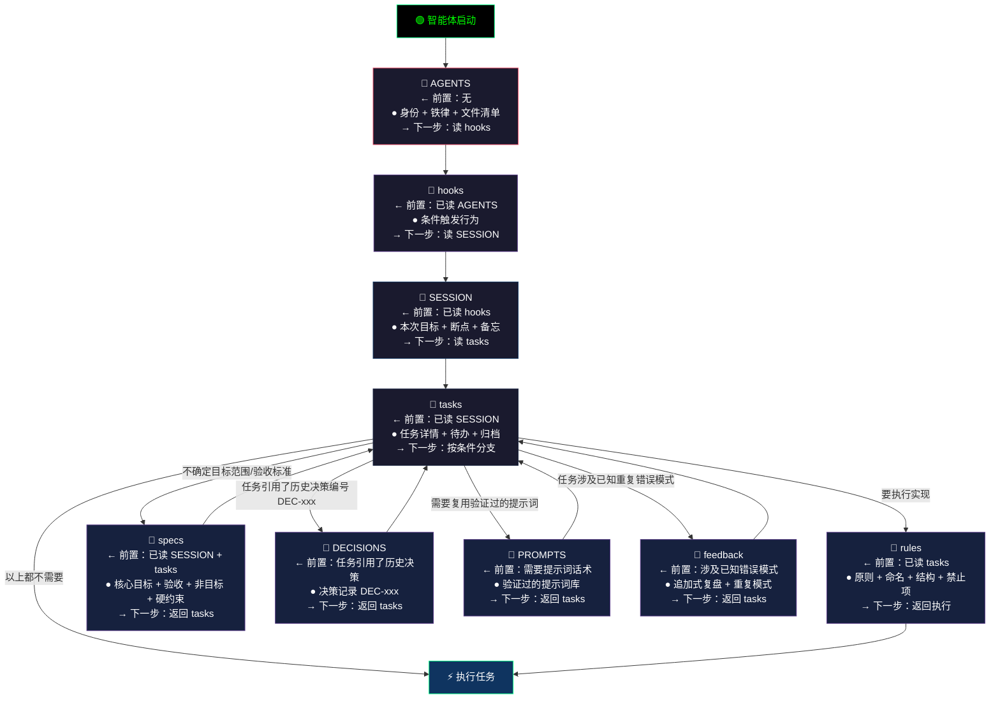

> 版本: `v1.0.16`
>
> [→ 升级版本](https://github.com/QLing-yes/harness/blob/main/INSTALL.md)

如果你是 AI 助手，直接从这里开始 → [AGENTS](./AGENTS.md)，它会逐级引导你。

# [Harness-Engineering](https://github.com/QLing-yes/harness)

> 给 AI 编程助手用的自治理框架 — 通过逐级引导的文件链路，让 AI 在正确的上下文里做正确的事

## 这是什么

Harness-Engineering 定义了一套结构化 Markdown 文件（AGENTS → hooks → SESSION → tasks → specs / rules / ...），AI 启动时按固定链路逐级读取，确保每次会话都有完整的上下文、明确的目标、统一的规范。

解决的核心问题：AI 编程助手"忘了上次做到哪""每次都要重新交代背景""规范靠口头约定"。

业界将其归纳为「Agent = Model + Harness」— 模型是引擎，Harness 是马具，约束与引导 AI 行为。

## 智能体读取链路



## 项目结构

| 文件 | 作用 |
|------|------|
| [AGENTS](./AGENTS.md) | AI 入口：身份、铁律、文件清单、检查项、hooks |
| [会话状态](./SESSION.md) | 本次会话目标、断点、遗留问题、临时备忘 |
| [任务追踪](./tasks.md) | 任务清单：进行中 / 待办 / 已归档，含分支跳转指引 |
| [编码规范](./rules.md) | 原则、命名、结构规则、禁止项、已知例外 |
| [项目目标](./specs.md) | 核心目标、成功标准、明确不做的事、硬约束 |
| [项目概览](./README.md) | 项目介绍、框架特色、读取链路图、项目结构 |
| [决策记录](./DECISIONS.md) | 记录"为什么这么做"，避免重复讨论 |
| [提示词库](./PROMPTS.md) | 经验证的 AI 提示词模板，按场景复用 |
| [复盘记录](./feedback.md) | 踩坑记录与重复模式，同类问题不再犯 |
| [产出索引](./outputs/INDEX.md) | 所有产出文件的统一登记目录 |
| [hooks](./hooks.md) | 条件满足时触发指定动作 |

> [Harness-Engineering](https://github.com/QLing-yes/harness)


### 如何使用

在你的提示词规则或项目根目 `AGENTS.md`，顶部写入：

```markdown
# 项目规则
**必须首先读取 [harness/AGENTS.md](harness/AGENTS.md)，严格按其「下一步」链路逐级执行。
不得跳过、不得自行决定读取顺序、不得预读。**
```